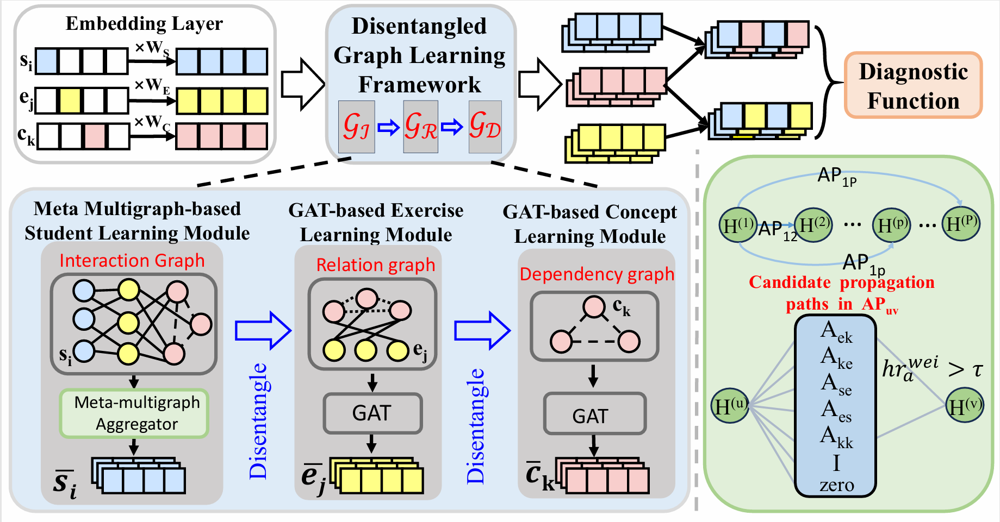

# 《DisenGCD: A Meta Multigraph-assisted Disentangled  Graph Learning Framework for Cognitive Diagnosis》

## Overview

Existing graph learning-based cognitive diagnosis (CD) methods have made relatively good results, but their student, exercise, and concept representations are
learned and exchanged in an implicit unified graph, which makes the interactionagnostic exercise and concept representations be learned poorly, failing to provide high robustness against noise in students’ interactions. Besides, lower-order exercise latent representations obtained in shallow layers are not well explored when learning the student representation. To tackle the issues, this paper suggests a meta multigraph-assisted disentangled graph learning framework for CD (DisenGCD), which learns three types of representations on three disentangled graphs: student-exercise-concept interaction, exercise-concept relation,and concept dependency graphs, respectively. Specifically, the latter two graphs are first disentangled from the interaction graph. Then, the student representation is learned from the interaction graph by a devised meta multigraph learning module; multiple learnable propagation paths in this module enable current student latent representation to access lower-order exercise latent representations, which can lead to more effective nad robust student representations learned; the exercise and concept representations are learned on the relation and dependency graphs by graph attention modules. Finally, a novel diagnostic function is devised to handle three disentangled representations for prediction. Experiments show better performance and robustness of DisenGCD than state-of-the-art CD methods and demonstrate the effectiveness of the disentangled learning framework and meta multigraph module.



## Installation

Install library

```
pip install -r requirements.txt

```

## How to Run Model

To run the DisenGCD, you should set the args of the dataset in config.py. And then:

```
python main.py

```

## Citation

If you find our work is useful for your research, please consider citing:

```

@inproceedings{DisenCD2024,
title={DisenGCD: A Meta Multigraph-assisted Disentangled  Graph Learning Framework for Cognitive Diagnosis.},
author={Shangshang  Yang and Mingyang Chen and Ziwen Wang and Xiaoshan Yu and Panpan Zhang and Haiping Ma and ingyi Zhang},
booktitle = {Thirty-Eighth Annual Conference on Neural Information Processing Systems},
year={2024}
}
```

## License

This project is licensed under the MIT License.
